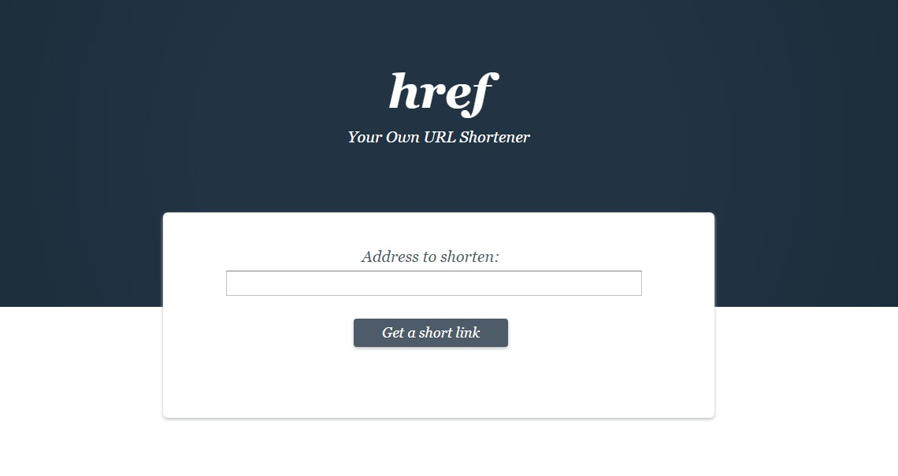

# LinkyLinky

A little URL shortener of your own.

## Example

[href.netlify.com](https://href.netlify.com)

## Description

This site provides a simple short URL generator for you to host on you own domain. It is not optimized for giant sites or commercial use, but would most likely be best suited for personal use or as an addition to a company site who might be generating a few hundred, or a few thousand short urls.

The redirect rules it generates will be created on Netlify's intelligent CDN and so should be very fast at access time. The generation of new shortcodes will use a static site generation build step to populate and deploy a Netlify `_redirects` file.

Any server side logic for the creation of unique shortcodes will take place in an AWS Lambda which will be created and managed from within Netlify thanks to [Netlify Functions](https://functions-beta--www.netlify.com/docs/lambda-functions/).

## Get your own

You can clone this repo to your own github account and create a new site on Netlify to make your own by clicking the _Deploy to Netlify button_ below.

After you have create a news site on Netlify via the button above, you will then need to perform the configuration steps below.

## Configuration

### 1. Environment variables

Before you can start using the URL shortener, you'll need to tell your build script where it can find your data. We'll make use of Netlify's [form handling](https://www.netlify.com/docs/form-handling/) and access the content via the provided [API](https://www.netlify.com/docs/api/#forms).

To do this we'll need to define the following Environment Variables:

- `ROUTES_FORM_ID` : The ID of the form in your Netlify site which contains all of your active routes (Discover this from the URL of your Routes form in your Forms admin page)
- `API_AUTH` : Your netlify API authentication token. This will let your build script access the routes stored in your form programmatically. (Create one at https://app.netlify.com/account/applications)

### 2. Build hooks

In order to add new redirect rules to the Netlify CDN, we'll need to rebuild and deploy the site when we have a new route. This is done by creating a build hook and then calling it whenever a new submission is posted to the Routes form.
